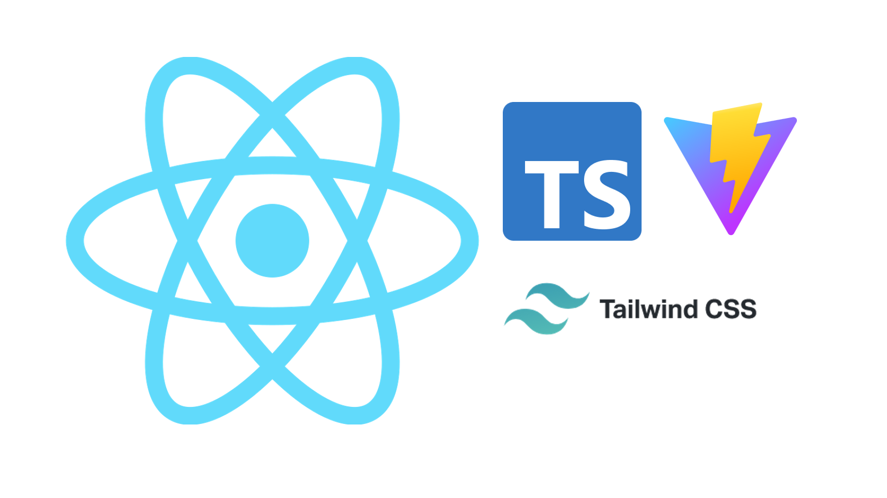

<p align='center'>
  
</p>

<p align='center'>
Mocking up web apps with <b>R-Ts-T</b><sup><em>(speed)</em></sup><br>
</p>

<br>

<p align='center'>
<a href="https://react-ts-tailwind.vercel.app">Live Demo</a>
</p>

<p align='center'>
<a href="https://codesandbox.io/p/github/kazim-kayhan/react-ts-tailwind/sandbox">View on Sandbox</a>
</p>

## Features

- ⚡️ [React 18](https://beta.reactjs.org/)
- 🦾 [TypeScript](https://www.typescriptlang.org/)
- 👑 [Jest](https://jestjs.io/) - unitary testing made easy
- 🎨 [Tailwind CSS](https://tailwindcss.com/) - next generation utility-first CSS
- 🗂 [Absolute imports](https://github.com/vitejs/vite/issues/88#issuecomment-762415200)
- 😃 [Hero icons](https://heroicons.com/)
- ☁️ Deploy on Vercel, zero-config

### Coding Style

- [ESLint](https://eslint.org/) - configured for React/Hooks & TypeScript
- [Prettier](https://prettier.io/)

### Dev tools

- [TypeScript](https://www.typescriptlang.org/)
- [vercel](https://vercel.com) - zero-config deployment

## Try it now!

### GitHub Template

[Create a repo from this template on GitHub](https://github.com/kazim-kayhan/react-ts-tailwind/generate).

### Clone to local

If you prefer to do it manually with the cleaner git history

```bash
npx degit kazim-kayhan/react-ts-tailwind your-project-name
cd your-project-name
yarn # If you don't have yarn installed, run: npm install -g yarn
```

## Checklist

When you use this template, try follow the checklist to update your info properly

- [ ] Rename `name` and `author` fields in `package.json`
- [ ] Change the author name in `LICENSE`
- [ ] Change the title in `index.html`
- [ ] Change the favicon in `public`
- [ ] Modify the manifest in `public`
- [ ] Clean up the README's

And, enjoy :)

[](https://vercel.com/import/project?template=https://github.com/kazim-kayhan/react-ts-tailwind)

## Why

I recently created several React apps, and the config setup was a bottleneck for me to quickly bring my ideas to life. To make the process easier, I created this starter template which includes some of the best practices I've learned from creating those apps. Feel free to customize it, star it, or even maintain your own fork.


## Usage

### Development

Just run and visit http://127.0.0.1:5173/

```bash
yarn dev
```

### Build

To build the App, run

```bash
yarn build
```

And you will see the generated file in `dist` that ready to be served.


### Husky

If pre-commit hooks are not working be sure that you have installed husky: `husky install`.

By default this command should be triggered after yarn/npm deps are installed.
